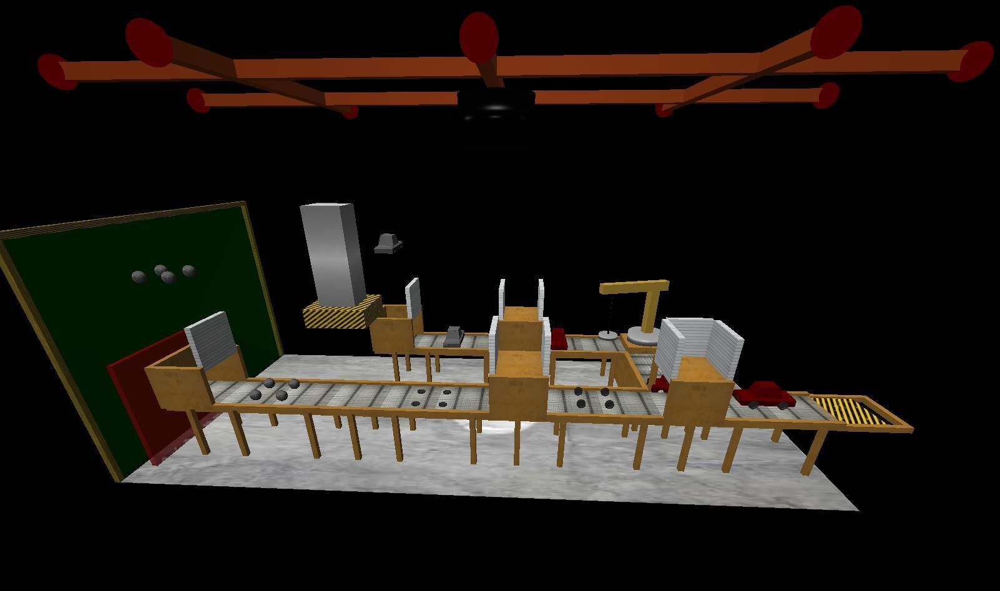

# Proyecto Final Informática Gráfica

El proyecto final consiste en diseñar una aplicación con la que visualizar un escenario de “diseño libre” con los siguientes requisitos:
- Debe ser un sistema compuesto de varios objetos articulados. En este sentido no se considerará válido un sistema compuesto por el mismo objeto replicado varias veces, como el sistema solar.
- Alguno de los objetos se debe mover de forma automática, otros deben poder ser controlados mediante el ratón y/o el teclado.
- Se deben incluir diferentes tipos de luces, alguna de las cuales debe poder moverse.
- Los objetos deben tener diferentes materiales y se deben incluir texturas.

La práctica se ha desarrollado usando Ubuntu 24.04 y las librerías usadas en clase. 

## Descripción de la escena
La escena representa una sección de una cadena de montaje en una fábrica de coches de juguete. El escenario se compone de Varias “maquinas” y cintas transportadoras conectándolas. Hay un flujo de objetos que entran y salen de la cadena de manera sincronizada. El recorrido comienza desde dos caminos: Uno que crea el chasis del coche y otro las ruedas. El chasis del coche entra en escena cayendo, se pinta de rojo y luego rota por otra cinta. Las ruedas primero son esferas y entran en escena cayendo también, luego son aplastadas convirtiéndose en ruedas, después se posicionan. Ahora los caminos de chasis y ruedas se unen y se ensambla en coche que cae por una compuerta. 

El escenario tiene iluminación direccional que representan las luces de la fábrica. Aparte de la luz direccional dirección –Y, hay otras luces direccionales para evitar que las caras que están a 90º queden demasiado oscuras. También hay una luz focal posicionada en un foco que se puede mover por unos railes encima de la cadena de montaje. Por último, hay un modo emergencia en el que se apagar las luces direccionales y se activan unas luces posicionales rojas que parpadean. 

A la izquierda hay una ventana desde la que se puede ver la cadena de montaje. 

## Cumplimientos de apartados
- Complejidad y originalidad de la escena. La escena está compuesta por muchas animaciones que deben estar sincronizadas entre ellas para que no haya objetos que se atraviesen. 
- Usabilidad, modularidad en el código, comentarios. La creación de cada objeto esta encapsulado en una función diferente. Las animaciones también están separadas en funciones. Pocos comentarios. 
- Movimiento / interacción con los objetos. El foco es el único objeto que se mueve a voluntad del usuario. Solo se puede mover por los raíles. 
- Movimiento / interacción con la cámara. No se ha modificado la interacción con la cámara. 
- Movimiento / interacción con las luces. Se pueden cambiar intensidad en las direccionales. Todas pueden apagarse y encenderse. Las direccionales además parpadean. 
- Uso de materiales y texturas. Se usan 7 materiales y 8 texturas. 
- Uso de transparencias (con solapes). Hay una ventana con un material transparente. Tiene otro material transparente rojo en medio para el solape. 
- Utilización de modelos externos. Se han usado un modelo de cilindro (porque el dado en clase no tenía tapas), para el chasis del coche y para las ruedas. Realmente las ruedas y el chasis eran de un modelo de coche, pero se ha separado usando Blender. 

## Manual de teclas
- Q,E - Diminuir/Aumentar la iluminación direccional
- R - Apagar/Encender la iluminación direccional 
- F - Apagar/Encender el foco 
- W,A,S,D - Movimiento del foco por los railes 
- 1 - Activar modo de iluminación normal (por defecto) 
- 2 - Activar modo de iluminación de emergencia 
- Ratón - Mover la cámara 
